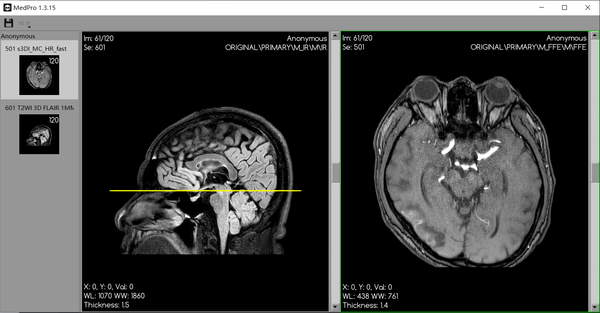

# MedPro

用于分析医学图像的软件，该软件在win10环境下测试通过。如果发现bug或者有其他要求，请[提交问题](https://github.com/zhang-qiang-github/MedPro/issues)。

请注意：该软件所在路径，以及之后的存储路径，不能包含中文。

update: [MedPro 1.3.15](https://github.com/zhang-qiang-github/MedPro/releases/tag/v1.3.15)
***

### 基础功能

1. 实现拖拽文件夹到软件窗口，软件会读取文件夹内的所有dicom。也可以拖拽mhd/nii.gz到窗口。
2. 具备一般dicom viewer的功能：放大缩小（右键），平移（鼠标中建），改变窗宽窗位（左键）
3. 实现多序列同时显示。在缩略图列，按住ctrl，鼠标左键点击，可添加序列多视图同时显示。在缩略图上双击，可以变回单视图。
4. 实现图像存储功能。点击工具栏“保存”按钮，打开保存窗口，实现存储。允许存储为mha/nii.gz

&emsp;&emsp;&emsp; 